# IT Infrastructure & DevOps Trainee — Practical Implementation

A hands-on Linux administration, containerization, automation, and
monitoring project built across two virtualized machines, demonstrating
end-to-end DevOps practices from server hardening to disaster recovery.

## Environment

Built and tested across two VirtualBox virtual machines on a single
host, connected via a Bridged Network Adapter so both machines sit on
the same LAN with independent IPs.

| Role | OS | Purpose |
|---|---|---|
| Server (server01) | Ubuntu Server 26.04 LTS | Hosts the Docker stack: Nginx, Flask app, PostgreSQL, monitoring |
| Client / Workstation | Debian (Desktop) | Remote administration over SSH, browser verification of web/TLS routing and dashboards |

- Hypervisor: Oracle VM VirtualBox
- Networking: Bridged Adapter mode on both VMs (real LAN IPs via DHCP)
- Server IP: 192.168.1.133
- All server administration performed remotely from the Debian client over SSH; no work done at the server's own console after initial provisioning

## Architecture

Debian (client) --SSH (port 2222)--> Ubuntu Server (192.168.1.133)

Nginx (80/443, only exposed service)
-> Flask App (internal :5000)
-> PostgreSQL (internal :5432, persistent volume)

Prometheus (:9090)
-> scrapes Node Exporter (:9100)
-> scrapes cAdvisor (:8080)

## Repository Structure

devops-trainee-assignment/
├── app/ Flask application (Dockerfile, app.py, requirements.txt)
├── nginx/ Reverse proxy config + self-signed TLS certs
├── prometheus/ Prometheus scrape configuration
├── scripts/ Automation: health check, backup, cert generation
├── setup/ Provisioning script and cron job definitions
├── screenshots/ Evidence for every task (see below)
├── docker-compose.yml Full service stack definition
├── .env.example Template for required environment variables
└── README.md This runbook

---

## Task 1 — Linux Administration & Security

Server hardening performed via `setup/01_provision_server.sh`:
- Created a non-root `trainee` user with sudo privileges
- Installed SSH key-based authentication (password login disabled)
- Moved SSH to port `2222`, disabled root login
- Configured UFW to allow only `2222` (SSH), `80` (HTTP), `443` (HTTPS) — default deny on everything else

**Setup commands:**

ssh-keygen -t ed25519 -C "trainee@devops-assignment"
cat ~/.ssh/id_ed25519.pub

ssh -p 2222 trainee@192.168.1.133
sudo ufw status verbose

**Evidence:**

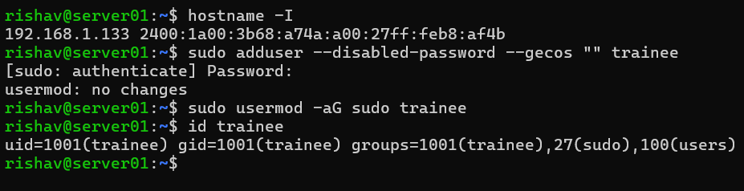
*Non-root trainee user created with sudo privileges*

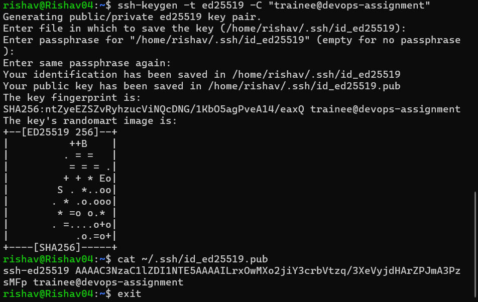
*SSH keypair generated on the Debian client*

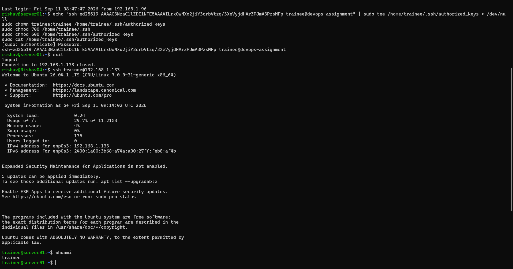
*Key-based login succeeding, trainee sudo access verified*

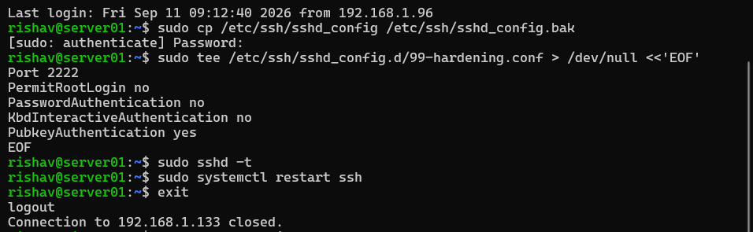
*sshd_config confirms port 2222, root login disabled, password auth disabled*

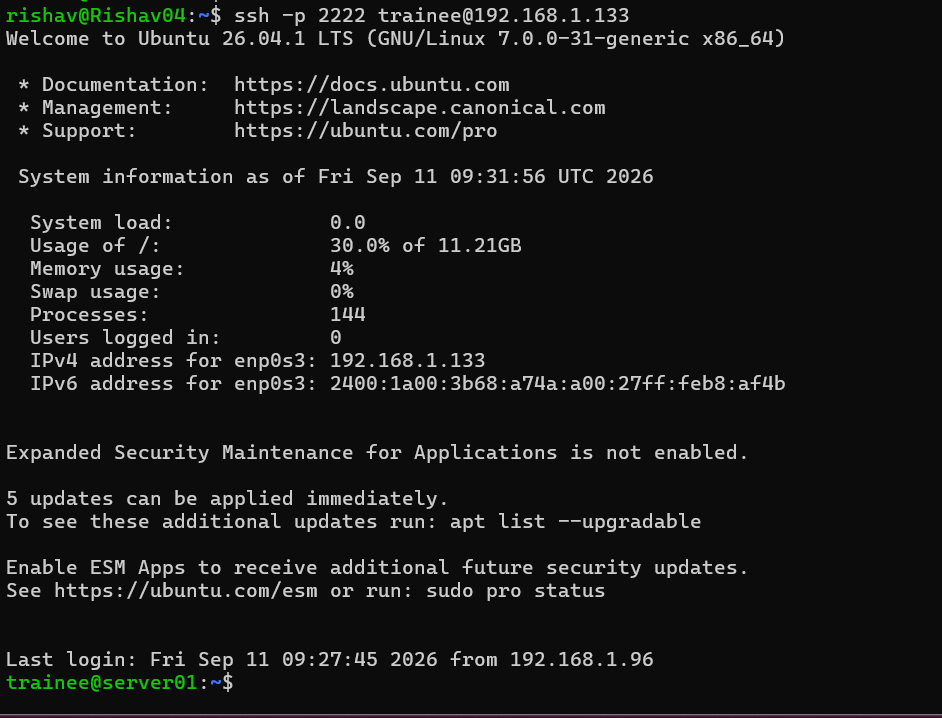
*Successful remote connection on the hardened port*

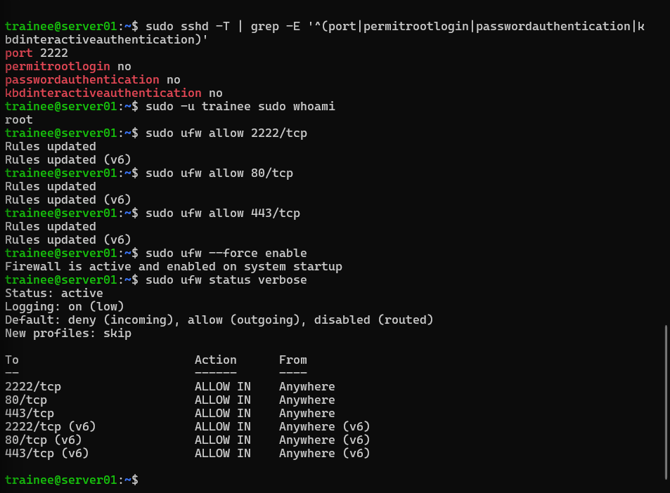
*Firewall restricted to 2222/80/443, default deny incoming*

---

## Task 2 — Containerization & Web Services

Three-tier stack deployed via Docker Compose:
- **Nginx** — reverse proxy, only service exposed on host ports 80/443
- **Flask app** — internal only (port 5000), reachable solely through the Docker `backend` network
- **PostgreSQL** — internal only (port 5432), data persisted via a named Docker volume

**Setup:**

cp .env.example .env
nano .env
chmod +x scripts/generate_self_signed_cert.sh
./scripts/generate_self_signed_cert.sh
docker compose up -d --build
docker compose ps

**Verification:**

curl http://localhost/
curl http://localhost/health
curl -k https://localhost/
docker volume inspect devops-trainee-assignment_db_data

**Evidence:**

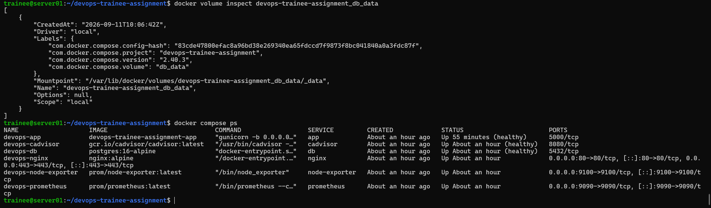
*Persistent database volume confirmed, all containers healthy*

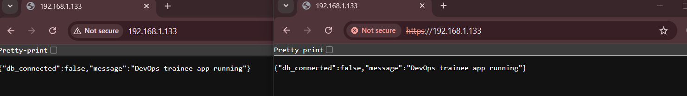
*Reverse-proxied application accessed via browser over HTTP and HTTPS (self-signed TLS)*

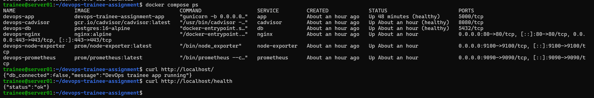
*curl verification of HTTP, health endpoint, and HTTPS routing through Nginx*

---

## Task 3 — Automation & Shell Scripting

`/opt/scripts/infra_health_check.sh` checks CPU, RAM, and disk usage,
Docker service status, and the application container's health. A
`[WARNING]` is logged if disk usage exceeds 85% or the app container is
not running; otherwise an `[INFO]` entry is logged.

**Manual run:**

sudo /opt/scripts/infra_health_check.sh
sudo tail -20 /var/log/infra_health.log

**Scheduled via cron**, every 15 minutes (`/etc/cron.d/infra-health-check`):

*/15 * * * * root /opt/scripts/infra_health_check.sh >> /var/log/infra_health_cron.log 2>&1

**Evidence:**

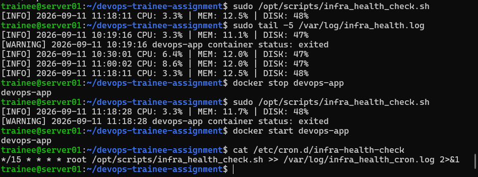
*Normal run, log output, WARNING triggered by stopping the app container, and cron job confirmed installed*

---

## Task 4 — Monitoring, Backups & Disaster Recovery

**Backup script** `/opt/scripts/db_backup.sh` dumps the PostgreSQL
database with `pg_dump`, compresses it with `gzip`, and stores it in
`/var/backups/db/` with a timestamped filename
(`db_backup_YYYYMMDD_HHMMSS.sql.gz`). The added time-of-day component
prevents same-day backups from overwriting one another; backups older
than 7 days are pruned automatically.

**Restore procedure:**

ls -l /var/backups/db/
sudo zcat /var/backups/db/<filename>.sql.gz | docker exec -i devops-db psql -U devopsuser -d devopsdb
docker exec -it devops-db psql -U devopsuser -d devopsdb -c '\dt'

**Disaster recovery was verified end-to-end**: a test table was
created, backed up, deliberately dropped to simulate data loss, then
successfully restored from the backup archive with data intact.

**Monitoring:** Prometheus scrapes Node Exporter (host metrics) and
cAdvisor (container metrics) every 15 seconds.
- Node Exporter: `http://192.168.1.133:9100/metrics`
- Prometheus targets: `http://192.168.1.133:9090/targets`

**Evidence:**

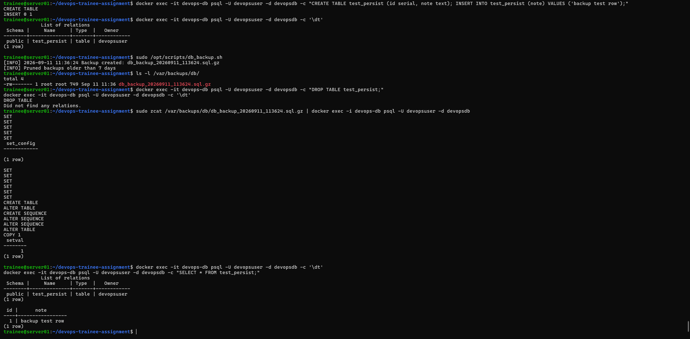
*Full disaster-recovery cycle: table created, backed up, dropped, restored, and verified intact*

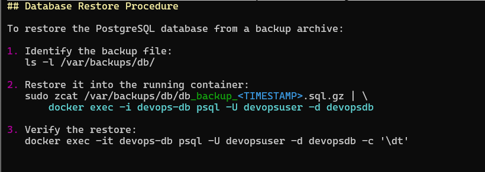
*Restore procedure documented in this README*

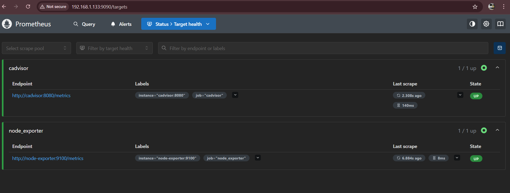
*Node Exporter and cAdvisor targets both reporting UP in Prometheus*

---

## Task 5 — Git & Documentation

Work was organized into feature branches and merged into `main` with
explicit merge commits to preserve history:

feature/docker-setup -> Nginx, Flask app, PostgreSQL, Prometheus config
feature/scripts -> health check script, backup script, cron jobs

**Evidence:**

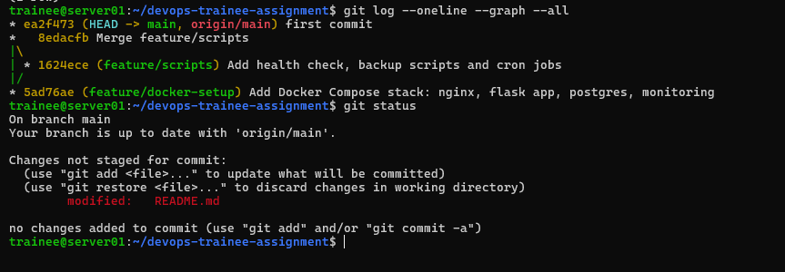
*Branch/merge history and clean working tree*

---

## Setup Summary

git clone https://github.com/RishavTh/it-infrastructure-devops.git
cd it-infrastructure-devops
cp .env.example .env
nano .env
chmod +x scripts/generate_self_signed_cert.sh
./scripts/generate_self_signed_cert.sh
docker compose up -d --build
docker compose ps

## Teardown

docker compose down # stop and remove containers, keep data
docker compose down --volumes # also wipe the database volume (destructive)

